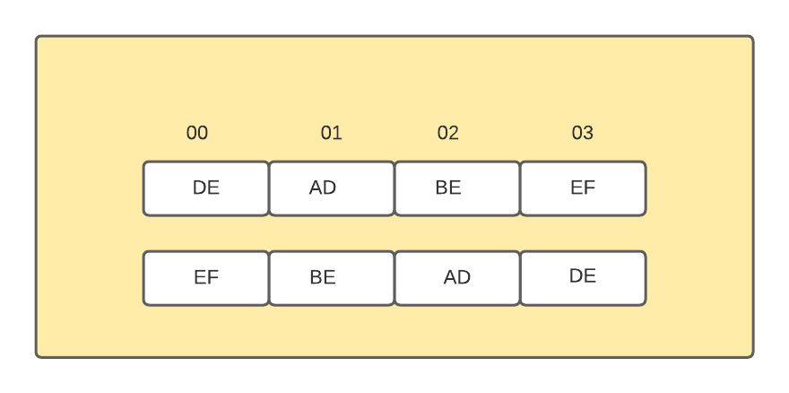

# A tale of two endians  

If you've ever tried to make two computers speak with each other at any scale, be it just creating a 
socket connection or or an entire distributed network. You've probably head the term endianness and the
troubles that it brings along. But before we delve deep into the topic lets make sure you actually have 
an idea how data is stored in a computer, make sure that you read it word by word :P.

## Number systems 

We are all familiar with indo-arabic number system, we've been taught it since pre-school that it is
literally second nature for us to read it.It takes less that second for us to read __123__ to understand
that it means One hundred and twenty three. But there is a lot going on behind this system,we have assigned a place value and face 
value for each position and character and we can break it down as follows

1. we assign each position a place value
    1. the left most position is assigned a place value of 1
    1. each position to the right is scaled by a factor of 10
1. we take the face value assigned to each character and multiply it by its place value 
1. add the results doing the above operation for each character

> 123 = 1 x 100 + 2 + 10 + 3 x 1
> each face value is multiplies by its place value and then summed up.

The entire process is quite well designed if you think about it, almost all our languages - english,hindi malayalam are all written and read from left to write, and the most significant bit that contributes most information to the number in consideration is on the left most end. This parallel to how languages are read is irrefutable. 

But come to think of it, that logic doesn't work does it. The number system is called indo-arabic. And in case you didn't know, arabic is written from right to left. Using that logic an arabic should read the 
number with the least significant bit towards the right giving use the answer three hundred and twenty one.

With just a simple change in how we parse the number the entire meaning gets corrupted and thus we understand that data alone is not enough but the rules to parse it, is what gives data its meaning. In the above example, the explanation is quite simple, while the arabic language developed independently with its
right to left parsing style, the number system was adopted from the indians with whom many arabic traders interacted. The indian number system was a revolution at that time considered to the roman numeral system which is quite a mess. The arabs agreed that they would follow the rules followed by indians so that they can represent and communicate their data freely.

The bottom line is data by itself is meaningless, it depends on how the person interprets it, information lies in the mind of the beholder.

## Data in computers

Lets make a quick jump from out medieval friends to the 20'th century. Data is represented in computers 
as bits (1's and 0's) which signify high and low voltages in some sort of semi-conductor technology. The stream of bits by itself is quite meaningless we use a group of 8 bits to encode information, this unit
is called a __byte__. A byte can represent a range of 256 values and the encoding depends on implementation. 

In addition to this modern day computers don't load and store data byte by byte but as a unit of bytes, determined by the architecture it follows, bus width and register sizes. A typical 32 bit architecture has a word size of 4 bytes or 32 bits. Data is addressed by words and the computer can only operate on a word as a unit. Each word is assigned an address and the bytes inside while they have addresses cannot be used to load just that byte alone.

A word can be used to represent an integer and its values can vary from 0 to 2^32, but even then we come to the problem of how to parse a word

Consider an integer with hex value 0xDEADBEEF, assuming the bits are read from left to right depending on
how we read the bytes within a word it can have two possible arrangements in memory.

You would assume from our medieval tale that everyone agreed upon one rule for parsing and they shared 
data with each other happily ever after, but if that was the case you wouldn't be here reading this would
you. One of most glaring examples of immature behaviour by the tech industry is the issue of endianess.

