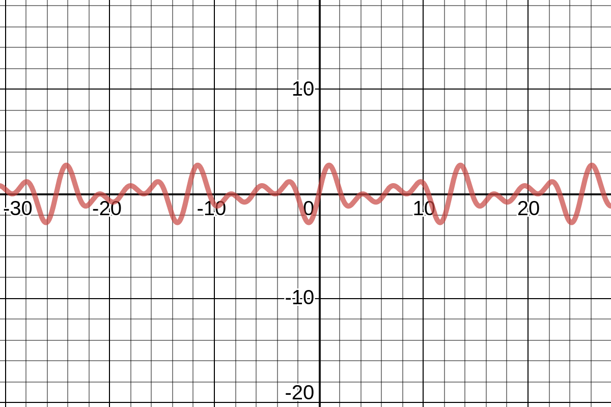
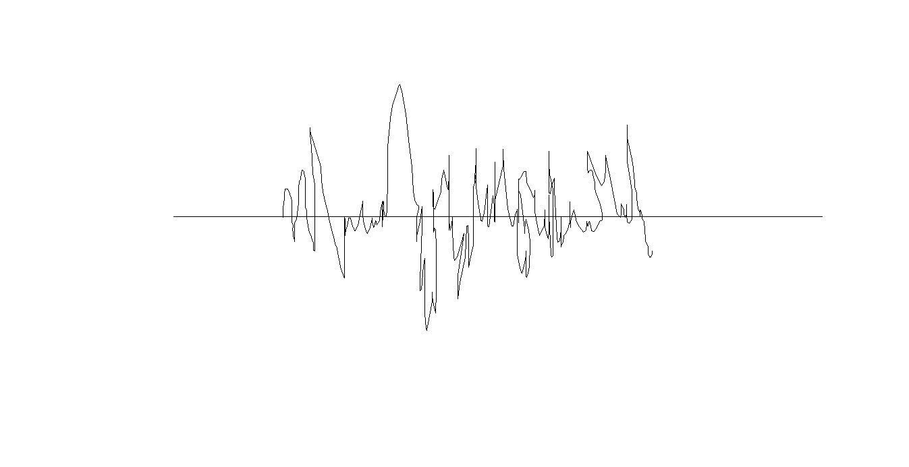

# Music art or science - Part 1

## Me and Music

Music plays an important role in each one of our lives, the first things we probably hear as newborns are our parents lullabies. We listen to music to relax, we sing chants and anthems in 
unison to bond and show solidarity. Simple tunes can elicit memories much better than a photo or video can, the effects of music are so widely varying both personal to each person and universal to humans 
at the same time. 

One of my fondest memories as a child is listening to Yesudas's ['mizhiariyathe'](https://www.youtube.com/watch?v=rwPsYQdxEO4)on our stereo during the weekend's but my interest in music is not just as listener alone, 
I used to sing when I was around 4, my mother taught me many songs one of them [Kandu Kandu Kandilla](https://www.youtube.com/watch?v=8RegKblneRw), which 
I sang in a music competition and almost got the chance to perform in front of M.G Sreekumar, as I grew older and my voice cracked I lost all ability to sing and stuck 
to being a bathroom singer, but I found my solace in learning musical instruments. I did quite well and while I enjoyed music I never actually understood it, it all seemed like magic to me, and as 
a grew more older and more pragmatic of the world, how music does what it does became something I spent a lot of time wondering about. This post and the rest that I hope will follow are records of my research
into music. 

---

## What exactly is sound??

Hearing is one of our 5 senses, and considering our body to be a system the ear is the sensor that picks up sound signals. The signals
that the ear picks up are sound waves or more precisely vibrations in the air. The ear acts as a transducer picking up these vibrations and converting them
to electric signals that can then be processed by our brain.

Sound waves require a medium to travel in as they propagate as an oscillatory movement of pressure or displacement of particles in the medium. Sound waves travel
in liquids and gases as longitudinal waves (i.e they oscillate along the direction the waves is moving) whereas they move as transverse (perpendicular to propagation direction) waves in solids.
To study sound waves we model them as sinusoidal waves or a combination of them. They thus have properties like

* Frequency
* Wavelength
* Amplitude
* Speed of propagation

The speed of sound depends on the medium and is constant for a given medium. Humans can hear sounds in air that are across the __20 Hz to 20 KHz__ spectrum. The speed of sound 
in air for given standard temperature and pressure conditions is 343 m/s.

## Noise vs Music

Just taking the literal meaning we understand that noise is used to label any sound that seems unpleasant, music is supposedly pleasant ( most of todays music don't seem to fit this description ). 
A more well defined meaning for use in our discussion would be music has some sort of ordering and regularity compared to noise which appears to be completely random. 

### Music signal

### Noise signal

---

