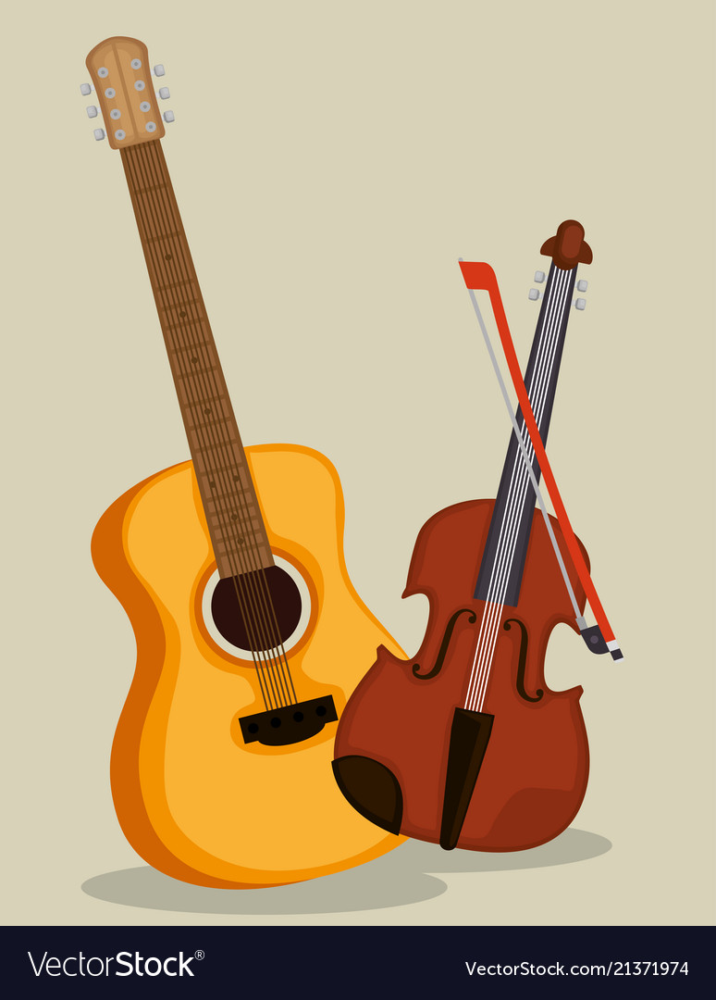

# Music art or science - Part 2

Hello there, lets have a quick recap, we brushed over basic topics like what sound is and what types of sounds we plan to label as music. 
If you don't know what I am talking about, you didn't read the heading right, this Part 2 :P. Go back to [Part 1](../music_science_or_art_1/music_science_or_art_1.html), but to be honest you didn't miss much other than a couple scribbles that I call graphs and me trying to show off about my musical prowess.

## Making Waves 

Think of the first acoustic instrument that comes to your mind, what was it guitar,flute, violin or drums ? Lets leave the drums out for now considering they are not mainly a tonal instrument, You could have guessed the similarity between the guitar and violin straight away, given that they look sort of similar. A wooden body, neck and strings which produce the sound. Though completely different tonally both of them have the same mechanism, you displace the strings somehow and set them in motion, the strings vibrate and give out a musical note. You might have noticed how musicians try and manipulate the strings length or use different strings to get different pitches. 

The differences in the tone of a guitar and violin arise mainly from

* difference in the thickness and material used for the strings
* difference in the length of the string
* difference in the shape and material used for the resonating wooden body
* the guitar is played by plucking, the violin string are drawn with a bow

